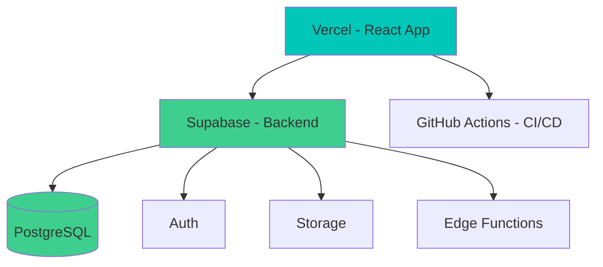
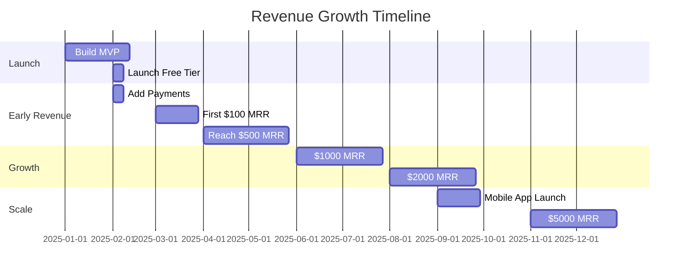

# Bootstrapped Implementation Plan
## Quran Lights Web - Solo Founder Edition

**Budget:** $0 (100% Free Tools)  
**Team:** Solo Founder  
**Timeline:** 12 months to profitability  
**Strategy:** Build → Launch → Monetize → Scale

---

## Executive Summary

This plan transforms Quran Lights into a profitable SaaS platform using **only free tools and services**, designed for a solo founder with zero budget. Focus is on rapid iteration, early monetization, and organic growth to fund expansion.

**Key Principles:**
- ✅ Use 100% free tools until revenue justifies paid upgrades
- ✅ Launch MVP in 4-6 weeks
- ✅ Start monetizing by Month 2
- ✅ Reinvest first revenue into growth
- ✅ Automate everything possible

---

## Phase 1: Foundation (Weeks 1-6) - $0 Budget

### 1.1 Free Technology Stack

#### **Frontend (100% Free)**
| Component | Free Tool | Why |
|-----------|-----------|-----|
| Framework | **Vite + React** | Fast, modern, zero config |
| Hosting | **Vercel Free Tier** | Unlimited bandwidth, auto-deploy |
| UI Library | **Tailwind CSS** | No cost, highly customizable |
| Components | **shadcn/ui** | Free, copy-paste components |
| Charts | **Recharts** | Free, React-native |
| Icons | **Lucide Icons** | Free, beautiful icons |
| Fonts | **Google Fonts** | Free, optimized delivery |

#### **Backend (100% Free)**
| Component | Free Tool | Limits | Sufficient For |
|-----------|-----------|--------|----------------|
| Database | **Supabase Free** | 500MB, 2GB bandwidth | 5,000+ users |
| Auth | **Supabase Auth** | Unlimited users | ∞ |
| Storage | **Supabase Storage** | 1GB | User uploads |
| API | **Supabase Edge Functions** | 500K invocations/mo | Early stage |
| Realtime | **Supabase Realtime** | Unlimited | Live updates |

#### **DevOps (100% Free)**
| Component | Free Tool | Limits |
|-----------|-----------|--------|
| Version Control | **GitHub** | Unlimited repos |
| CI/CD | **GitHub Actions** | 2,000 min/month |
| Monitoring | **Sentry Free** | 5K events/month |
| Analytics | **Plausible CE (self-hosted)** | Unlimited |
| Email | **Resend Free** | 100 emails/day |
| Domain | **Freenom** or use existing | Free .tk/.ml/.ga |

#### **AI/ML (100% Free)**
| Service | Free Tier | Usage |
|---------|-----------|-------|
| OpenAI | $5 credit (trial) | Initial testing |
| Anthropic Claude | Free tier | API calls |
| Hugging Face | Free inference | Open-source models |
| Google Gemini | Free tier | 60 requests/min |

### 1.2 Lean Architecture



### 1.3 Week-by-Week Execution

**Week 1: Setup**
- [ ] Create GitHub repo
- [ ] Set up Supabase project
- [ ] Initialize Vite + React + TypeScript
- [ ] Configure Tailwind CSS + shadcn/ui
- [ ] Deploy to Vercel (auto-deploy on push)

**Week 2: Core Features**
- [ ] Implement Supabase Auth (email/password)
- [ ] Create user dashboard layout
- [ ] Build Surah tracking grid (migrate from current)
- [ ] Add basic statistics display

**Week 3: Data Migration**
- [ ] Design PostgreSQL schema in Supabase
- [ ] Create migration script from Firebase
- [ ] Implement data import/export
- [ ] Test data integrity

**Week 4: Charts & Visualizations**
- [ ] Integrate Recharts
- [ ] Migrate daily/monthly/yearly charts
- [ ] Add radar chart for Surah tracking
- [ ] Implement light/dark theme

**Week 5: Polish & Testing**
- [ ] Add loading states and error handling
- [ ] Implement responsive design
- [ ] Set up Sentry error tracking
- [ ] Write basic tests

**Week 6: Launch Prep**
- [ ] Create landing page with pricing
- [ ] Set up email notifications (Resend)
- [ ] Add analytics (Plausible)
- [ ] Prepare launch materials

**Deliverable:** Fully functional MVP on Vercel with Supabase backend

---

## Phase 2: Early Monetization (Weeks 7-10) - Target: First $100 MRR

### 2.1 Freemium Model (Launch Day 1)

**Free Tier (Forever Free)**
- ✅ 1 profile
- ✅ Basic charts (3 types)
- ✅ Daily tracking
- ✅ 30-day history
- ✅ Data export (CSV only)
- ✅ Community support

**Premium Tier ($4.99/month or $49/year)**
- ✅ Unlimited profiles (family/students)
- ✅ All chart types (10+)
- ✅ Unlimited history
- ✅ Advanced analytics
- ✅ PDF reports
- ✅ Priority email support
- ✅ Early access to new features

### 2.2 Payment Processing (Free Until Revenue)

**Stripe (Free to start)**
- No monthly fee
- 2.9% + $0.30 per transaction
- Only pay when you earn

**Implementation:**
```typescript
// Stripe Checkout (no backend needed initially)
import { loadStripe } from '@stripe/stripe-js';

const stripe = await loadStripe(process.env.VITE_STRIPE_PUBLIC_KEY);

// Redirect to Stripe Checkout
const { error } = await stripe.redirectToCheckout({
  lineItems: [{ price: 'price_premium_monthly', quantity: 1 }],
  mode: 'subscription',
  successUrl: `${window.location.origin}/success`,
  cancelUrl: `${window.location.origin}/pricing`,
});
```

**Supabase Integration:**
```sql
-- Subscription tracking in Supabase
CREATE TABLE subscriptions (
  id UUID PRIMARY KEY DEFAULT gen_random_uuid(),
  user_id UUID REFERENCES auth.users(id),
  stripe_customer_id TEXT,
  stripe_subscription_id TEXT,
  status TEXT,
  plan TEXT,
  current_period_end TIMESTAMP,
  created_at TIMESTAMP DEFAULT NOW()
);

-- Row Level Security
ALTER TABLE subscriptions ENABLE ROW LEVEL SECURITY;
CREATE POLICY "Users can view own subscription"
  ON subscriptions FOR SELECT
  USING (auth.uid() = user_id);
```

### 2.3 Early Revenue Tactics

**Week 7: Launch**
- [ ] Post on ProductHunt (free)
- [ ] Share on Reddit r/Quran, r/islam (free)
- [ ] Post in Facebook groups (free)
- [ ] Email existing Firebase users (free)
- [ ] Create Twitter/X thread (free)

**Week 8: Content Marketing**
- [ ] Write 3 blog posts (SEO optimized)
- [ ] Create YouTube tutorial (free hosting)
- [ ] Post on LinkedIn (free)
- [ ] Submit to startup directories (free)

**Week 9: Community Building**
- [ ] Create Discord server (free)
- [ ] Start weekly tips email (Resend free tier)
- [ ] Engage with users daily
- [ ] Collect testimonials

**Week 10: Optimization**
- [ ] A/B test pricing page
- [ ] Add social proof (user count, testimonials)
- [ ] Implement exit-intent popup (discount offer)
- [ ] Create referral program (10% discount)

**Target Metrics:**
- 500 free users
- 10 paid users ($50 MRR)
- 5% conversion rate

---

## Phase 3: Growth & Automation (Months 3-6) - Target: $500 MRR

### 3.1 Revenue Milestones & Reinvestment

**$100 MRR → Upgrade Analytics**
- Invest in: Plausible Analytics ($9/mo)
- Benefit: Better conversion tracking

**$200 MRR → Upgrade Email**
- Invest in: Resend Pro ($20/mo)
- Benefit: 50K emails/month, better deliverability

**$300 MRR → Custom Domain**
- Invest in: .com domain ($12/year)
- Benefit: Professional branding

**$400 MRR → AI Features**
- Invest in: OpenAI API credits ($50/mo)
- Benefit: AI-powered insights

**$500 MRR → Marketing**
- Invest in: Google Ads ($100/mo)
- Benefit: Paid user acquisition

### 3.2 Automation (Still Free)

**GitHub Actions Workflows:**
```yaml
# .github/workflows/deploy.yml
name: Deploy
on:
  push:
    branches: [main]
jobs:
  deploy:
    runs-on: ubuntu-latest
    steps:
      - uses: actions/checkout@v3
      - uses: actions/setup-node@v3
      - run: npm ci
      - run: npm test
      - run: npm run build
      # Vercel auto-deploys on push
```

**Supabase Edge Functions (Cron Jobs):**
```typescript
// supabase/functions/daily-stats/index.ts
Deno.serve(async (req) => {
  // Run daily at midnight
  // Calculate user statistics
  // Send email summaries
  // Update leaderboards
});
```

**Zapier Free Tier (5 Zaps, 100 tasks/month):**
- New user → Welcome email
- New subscription → Slack notification
- Cancellation → Feedback form
- Weekly stats → Email digest

### 3.3 Growth Tactics (Free/Low Cost)

**Content Marketing:**
- [ ] Publish 2 blog posts/week (free)
- [ ] Create 1 YouTube video/week (free)
- [ ] Guest post on Islamic blogs (free)
- [ ] Podcast interviews (free)

**SEO Optimization:**
- [ ] Optimize for "Quran tracking app" (free)
- [ ] Build backlinks through guest posts (free)
- [ ] Submit to directories (free)
- [ ] Create comparison pages (free)

**Social Media:**
- [ ] Daily posts on Twitter/X (free)
- [ ] Instagram reels (free)
- [ ] TikTok short videos (free)
- [ ] LinkedIn articles (free)

**Community:**
- [ ] Host weekly Q&A sessions (free)
- [ ] Create user showcase (free)
- [ ] Feature user stories (free)
- [ ] Build ambassador program (free)

**Target Metrics:**
- 2,000 free users
- 100 paid users ($500 MRR)
- 5% conversion rate maintained

---

## Phase 4: Scale & Expand (Months 7-12) - Target: $2,000 MRR

### 4.1 Advanced Features (Funded by Revenue)

**Month 7-8: AI Integration ($500 MRR)**
```typescript
// AI Study Planner using free Gemini API
import { GoogleGenerativeAI } from "@google/generative-ai";

const genAI = new GoogleGenerativeAI(process.env.GEMINI_API_KEY);

async function generateStudyPlan(userProgress: UserProgress) {
  const model = genAI.getGenerativeModel({ model: "gemini-pro" });
  
  const prompt = `Based on this Quran recitation data: ${JSON.stringify(userProgress)}, 
    create a personalized 7-day study plan focusing on Surahs that need review.`;
  
  const result = await model.generateContent(prompt);
  return result.response.text();
}
```

**Month 9-10: Mobile App ($1,000 MRR)**
- Use **Expo (free)** for React Native
- Deploy to **Google Play** ($25 one-time)
- Deploy to **App Store** ($99/year)
- Share codebase with web app (80% reuse)

**Month 11-12: Premium Features ($1,500 MRR)**
- Voice recitation tracking (Web Speech API - free)
- Advanced analytics dashboard
- Team/family management
- White-label option for institutions

### 4.2 Revenue Diversification

**1. Tiered Subscriptions**
- Free: $0 (unlimited users)
- Basic: $4.99/mo (individuals)
- Family: $9.99/mo (up to 5 members)
- Institution: $49/mo (up to 50 students)

**2. One-Time Purchases**
- Lifetime access: $199 (one-time)
- Custom reports: $29 each
- Personalized coaching: $99/session

**3. Affiliate Program**
- 20% recurring commission
- Free to set up (use Rewardful free tier)
- Automated payouts via Stripe

**4. Donations (Sadaqah)**
- Add "Support Development" button
- Use Stripe Checkout (no platform fees)
- Offer tax receipts (if applicable)

### 4.3 Infrastructure Upgrades (Revenue-Funded)

**$1,000 MRR:**
- Upgrade Supabase to Pro ($25/mo)
  - 8GB database
  - 50GB bandwidth
  - Daily backups
  
**$1,500 MRR:**
- Add Cloudflare Pro ($20/mo)
  - Better CDN
  - Advanced security
  - Image optimization

**$2,000 MRR:**
- Hire part-time VA ($500/mo)
  - Customer support
  - Content creation
  - Social media management

**Target Metrics:**
- 10,000 free users
- 400 paid users ($2,000 MRR)
- 4% conversion rate
- Break-even or profitable

---

## Free Tools Comprehensive List

### Development Tools (100% Free)

| Category | Tool | Purpose |
|----------|------|---------|
| Code Editor | **VS Code** | Development |
| Version Control | **GitHub** | Code repository |
| Package Manager | **npm** | Dependencies |
| Build Tool | **Vite** | Fast builds |
| Linter | **ESLint** | Code quality |
| Formatter | **Prettier** | Code formatting |
| Testing | **Vitest** | Unit tests |
| E2E Testing | **Playwright** | Browser testing |

### Design Tools (100% Free)

| Tool | Purpose | Limit |
|------|---------|-------|
| **Figma Free** | UI/UX design | 3 projects |
| **Canva Free** | Graphics | Unlimited |
| **Unsplash** | Stock photos | Unlimited |
| **Lucide Icons** | Icons | Unlimited |
| **Google Fonts** | Typography | Unlimited |

### Marketing Tools (100% Free)

| Tool | Purpose | Limit |
|------|---------|-------|
| **Mailchimp Free** | Email marketing | 500 contacts |
| **Buffer Free** | Social scheduling | 3 channels |
| **Canva** | Social graphics | Unlimited |
| **Google Analytics** | Web analytics | Unlimited |
| **Google Search Console** | SEO | Unlimited |

### Communication (100% Free)

| Tool | Purpose |
|------|---------|
| **Discord** | Community |
| **Slack Free** | Team chat |
| **Google Meet** | Video calls |
| **Gmail** | Email |

---

## Monetization Timeline



---

## Revenue Projections (Conservative)

| Month | Free Users | Paid Users | MRR | Costs | Profit |
|-------|-----------|-----------|-----|-------|--------|
| 1 | 100 | 0 | $0 | $0 | $0 |
| 2 | 300 | 5 | $25 | $0 | $25 |
| 3 | 500 | 20 | $100 | $0 | $100 |
| 4 | 1,000 | 50 | $250 | $30 | $220 |
| 5 | 1,500 | 80 | $400 | $50 | $350 |
| 6 | 2,000 | 100 | $500 | $100 | $400 |
| 9 | 5,000 | 200 | $1,000 | $200 | $800 |
| 12 | 10,000 | 400 | $2,000 | $500 | $1,500 |

**Key Assumptions:**
- 5% free-to-paid conversion rate
- $5 average revenue per user (ARPU)
- 3% monthly churn rate
- Organic growth only (no paid ads initially)

---

## Critical Success Factors

### 1. Speed to Market
- Launch MVP in 6 weeks
- Don't wait for perfection
- Iterate based on user feedback

### 2. Early Monetization
- Add payments by Week 7
- Don't wait to "grow first"
- Validate willingness to pay early

### 3. User Acquisition (Free Channels)
- ProductHunt launch
- Reddit communities
- Facebook groups
- Email existing users
- Word of mouth

### 4. Retention Focus
- Weekly engagement emails
- Feature announcements
- User success stories
- Community building

### 5. Automation
- Automate deployments
- Automate emails
- Automate billing
- Automate analytics

---

## Risk Mitigation (Zero Budget)

| Risk | Free Mitigation |
|------|-----------------|
| **Server costs** | Use free tiers (Vercel, Supabase) |
| **No users** | Launch on ProductHunt, Reddit |
| **No conversions** | A/B test pricing, add social proof |
| **Technical issues** | Use Sentry free tier for monitoring |
| **Competition** | Focus on niche (Quran tracking) |
| **Burnout** | Set realistic goals, automate |

---

## When to Upgrade from Free Tools

| Tool | Upgrade At | Cost | Why |
|------|-----------|------|-----|
| Supabase | 5,000 users | $25/mo | Need more storage |
| Vercel | Never | $0 | Free tier sufficient |
| Analytics | $100 MRR | $9/mo | Better insights |
| Email | $200 MRR | $20/mo | More sends |
| Domain | $300 MRR | $12/yr | Professional |
| AI API | $400 MRR | $50/mo | Premium features |

---

## Action Plan - Next 7 Days

### Day 1: Setup
- [ ] Create GitHub repo
- [ ] Set up Supabase project
- [ ] Initialize Vite + React project
- [ ] Deploy to Vercel

### Day 2: Authentication
- [ ] Integrate Supabase Auth
- [ ] Create login/signup pages
- [ ] Test authentication flow

### Day 3: Database
- [ ] Design PostgreSQL schema
- [ ] Create tables in Supabase
- [ ] Set up Row Level Security

### Day 4: Core UI
- [ ] Install Tailwind + shadcn/ui
- [ ] Create dashboard layout
- [ ] Build Surah tracking grid

### Day 5: Data Migration
- [ ] Write Firebase export script
- [ ] Import data to Supabase
- [ ] Verify data integrity

### Day 6: Charts
- [ ] Install Recharts
- [ ] Create daily chart
- [ ] Create monthly chart

### Day 7: Deploy & Test
- [ ] Final testing
- [ ] Fix bugs
- [ ] Prepare for Week 2

---

## Success Metrics

### Week 6 (Launch)
- ✅ MVP deployed to production
- ✅ 0 critical bugs
- ✅ Payment integration ready
- ✅ Landing page live

### Month 3
- ✅ 500+ free users
- ✅ 20+ paid users
- ✅ $100+ MRR
- ✅ 5% conversion rate

### Month 6
- ✅ 2,000+ free users
- ✅ 100+ paid users
- ✅ $500+ MRR
- ✅ Profitable (revenue > costs)

### Month 12
- ✅ 10,000+ free users
- ✅ 400+ paid users
- ✅ $2,000+ MRR
- ✅ Mobile app launched
- ✅ Sustainable business

---

## Conclusion

This bootstrapped plan enables you to:

✅ **Start immediately** with $0 investment  
✅ **Launch in 6 weeks** using free tools  
✅ **Monetize by Month 2** with Stripe  
✅ **Reach profitability** by Month 6  
✅ **Scale sustainably** by reinvesting revenue  

**The key is to start small, launch fast, and let revenue fund growth.**

---

## Appendix: Free Tool Alternatives

### If Supabase Limits Hit

**Alternative 1: PlanetScale (Free)**
- 5GB storage
- 1 billion row reads/month
- MySQL compatible

**Alternative 2: Neon (Free)**
- 3GB storage
- PostgreSQL
- Serverless

**Alternative 3: Railway (Free)**
- $5 free credit/month
- PostgreSQL + Redis
- Auto-scaling

### If Vercel Limits Hit

**Alternative 1: Netlify (Free)**
- 100GB bandwidth
- Unlimited sites
- Auto-deploy

**Alternative 2: Cloudflare Pages (Free)**
- Unlimited bandwidth
- Unlimited requests
- Global CDN

**Alternative 3: GitHub Pages (Free)**
- Static hosting
- Custom domain
- HTTPS included

---

**Next Step:** Start Day 1 of the 7-day action plan and build your MVP! 🚀
