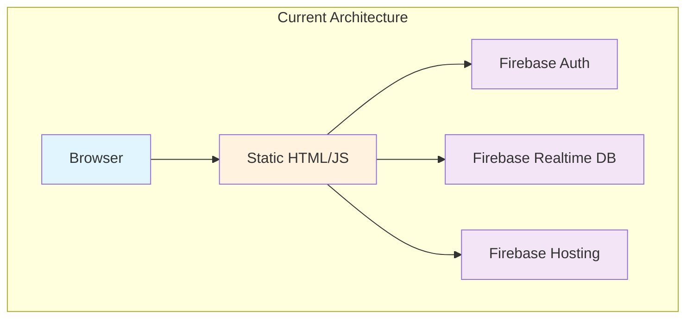
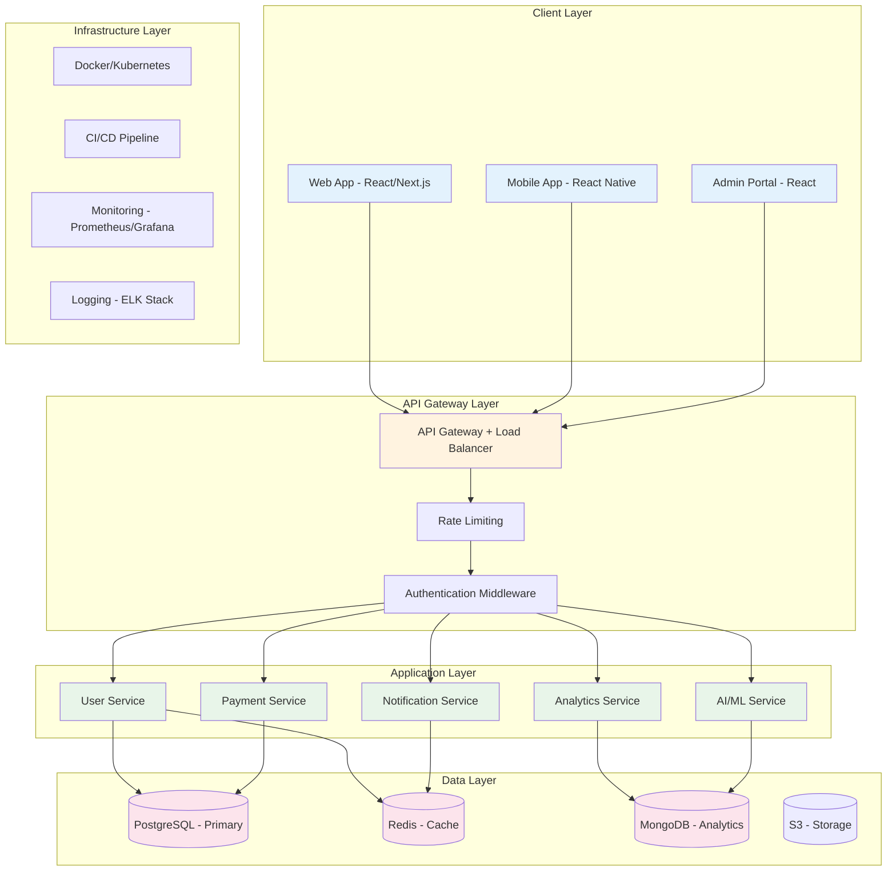
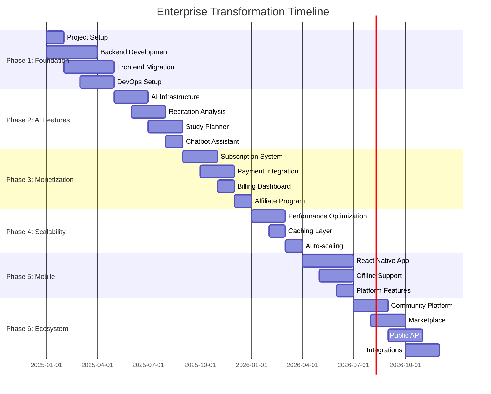
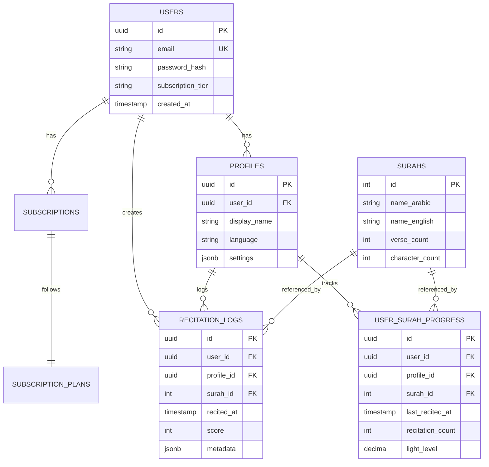

# Enterprise Analysis & Transformation Plan
## Quran Lights Web Platform

**Prepared by:** World-Class Software Architect  
**Date:** December 14, 2025  
**Version:** 1.0

---

## Executive Summary

Quran Lights is an innovative web platform for tracking Quran recitation and memorization through visual dashboards and analytics. This report provides a comprehensive enterprise-grade transformation roadmap to evolve the platform into a production-ready, scalable, monetizable SaaS solution with AI-powered features.

**Current State:** MVP web application with Firebase hosting  
**Target State:** Enterprise-grade multi-tenant SaaS platform with AI capabilities  
**Estimated Timeline:** 18-24 months across 6 phases  
**Investment Required:** Medium to High (detailed in monetization section)

---

## 1. Current State Analysis

### 1.1 Technology Stack Assessment

#### **Frontend**
- ✅ **Strengths:**
  - Multi-language support (10 languages with i18n)
  - Responsive design with Bootstrap
  - Interactive visualizations (Highcharts)
  - Theme toggle (dark/light mode)
  
- ⚠️ **Limitations:**
  - Vanilla JavaScript (no modern framework)
  - jQuery dependency (outdated)
  - No component architecture
  - Limited state management
  - No TypeScript type safety
  - Mixed inline scripts and external files

#### **Backend**
- ⚠️ **Critical Gaps:**
  - Firebase only (limited backend logic)
  - No REST/GraphQL API layer
  - No server-side validation
  - No rate limiting or security middleware
  - No caching strategy
  - No background job processing

#### **Database**
- ⚠️ **Limitations:**
  - Firebase Realtime Database (NoSQL only)
  - No relational data modeling
  - Limited query capabilities
  - No data warehousing
  - No analytics pipeline

#### **Infrastructure**
- ⚠️ **Gaps:**
  - Firebase Hosting only
  - No CDN optimization
  - No containerization
  - No CI/CD pipeline
  - No monitoring/observability
  - No disaster recovery

### 1.2 Feature Analysis

#### **Existing Features**
1. ✅ User authentication (email/password)
2. ✅ Surah tracking with visual cells
3. ✅ Multiple chart types (radar, treemap, gauges)
4. ✅ Memorization progress tracking
5. ✅ Daily/monthly/yearly statistics
6. ✅ Multi-language support
7. ✅ Import/export functionality
8. ✅ Customizable settings

#### **Missing Enterprise Features**
1. ❌ Multi-tenant architecture
2. ❌ Role-based access control (RBAC)
3. ❌ API for mobile/third-party integration
4. ❌ Real-time collaboration
5. ❌ Advanced analytics & AI insights
6. ❌ Payment processing
7. ❌ Admin dashboard
8. ❌ Audit logging
9. ❌ Data backup/restore
10. ❌ Performance monitoring

### 1.3 Architecture Assessment



**Critical Issues:**
- No separation of concerns
- Tight coupling to Firebase
- Client-side business logic
- No API layer for extensibility
- Limited scalability options

---

## 2. Enterprise-Grade Recommendations

### 2.1 Target Architecture



### 2.2 Technology Stack Recommendations

#### **Frontend Stack**
| Component | Current | Recommended | Rationale |
|-----------|---------|-------------|-----------|
| Framework | Vanilla JS | **Next.js 14+** | SSR, SEO, performance, TypeScript |
| State Management | localStorage | **Zustand/Redux Toolkit** | Predictable state, DevTools |
| UI Library | Bootstrap | **Tailwind CSS + shadcn/ui** | Modern, customizable, accessible |
| Charts | Highcharts | **Recharts/Apache ECharts** | React-native, open-source |
| Type Safety | None | **TypeScript** | Type safety, better DX |
| Testing | Cucumber | **Vitest + Playwright** | Fast, modern testing |

#### **Backend Stack**
| Component | Recommended | Purpose |
|-----------|-------------|---------|
| Runtime | **Node.js 20 LTS** | JavaScript ecosystem consistency |
| Framework | **NestJS** | Enterprise architecture, TypeScript, scalable |
| API Style | **GraphQL + REST** | Flexible queries + standard endpoints |
| ORM | **Prisma** | Type-safe database access |
| Validation | **Zod** | Runtime type validation |
| Authentication | **Auth0/Clerk** | Enterprise SSO, MFA, social login |
| Job Queue | **BullMQ** | Background processing |

#### **Database Stack**
| Type | Technology | Use Case |
|------|------------|----------|
| Primary DB | **PostgreSQL 16** | User data, transactions, ACID compliance |
| Cache | **Redis 7** | Session, rate limiting, real-time data |
| Analytics | **ClickHouse** | Time-series analytics, reporting |
| Search | **Elasticsearch** | Full-text search, Quran verses |
| Object Storage | **AWS S3/MinIO** | User uploads, backups |

#### **Infrastructure Stack**
| Component | Technology | Purpose |
|-----------|------------|---------|
| Containerization | **Docker** | Consistent environments |
| Orchestration | **Kubernetes** | Auto-scaling, self-healing |
| CI/CD | **GitHub Actions** | Automated testing & deployment |
| Monitoring | **Prometheus + Grafana** | Metrics, alerting |
| Logging | **Loki + Grafana** | Centralized logging |
| Tracing | **Jaeger** | Distributed tracing |
| CDN | **Cloudflare** | Global edge caching |

---

## 3. Multi-Phase AI-Agent Implementation Plan

### Phase 1: Foundation & Migration (Months 1-4)

#### **Objectives**
- Establish modern development infrastructure
- Migrate to scalable architecture
- Implement core backend services
- Set up CI/CD and monitoring

#### **Tasks**

**1.1 Project Setup**
```bash
# New monorepo structure
quran-lights-platform/
├── apps/
│   ├── web/                 # Next.js web app
│   ├── mobile/              # React Native app
│   ├── admin/               # Admin dashboard
│   └── api/                 # NestJS backend
├── packages/
│   ├── ui/                  # Shared UI components
│   ├── types/               # Shared TypeScript types
│   ├── utils/               # Shared utilities
│   └── config/              # Shared configs
├── infrastructure/
│   ├── docker/              # Docker configs
│   ├── kubernetes/          # K8s manifests
│   └── terraform/           # Infrastructure as Code
└── docs/                    # Documentation
```

**1.2 Backend API Development**
- [ ] Set up NestJS project with TypeScript
- [ ] Implement authentication module (JWT + refresh tokens)
- [ ] Create user management service
- [ ] Develop Surah tracking API
- [ ] Build analytics aggregation service
- [ ] Implement data migration from Firebase
- [ ] Add comprehensive API documentation (Swagger)

**1.3 Database Migration**
```sql
-- PostgreSQL Schema Design
CREATE TABLE users (
    id UUID PRIMARY KEY DEFAULT gen_random_uuid(),
    email VARCHAR(255) UNIQUE NOT NULL,
    password_hash VARCHAR(255),
    full_name VARCHAR(255),
    subscription_tier VARCHAR(50) DEFAULT 'free',
    created_at TIMESTAMP DEFAULT NOW(),
    updated_at TIMESTAMP DEFAULT NOW()
);

CREATE TABLE profiles (
    id UUID PRIMARY KEY DEFAULT gen_random_uuid(),
    user_id UUID REFERENCES users(id) ON DELETE CASCADE,
    display_name VARCHAR(255),
    language VARCHAR(10) DEFAULT 'ar',
    theme VARCHAR(20) DEFAULT 'dark',
    timezone VARCHAR(50),
    settings JSONB
);

CREATE TABLE surahs (
    id INTEGER PRIMARY KEY,
    name_arabic VARCHAR(255),
    name_english VARCHAR(255),
    revelation_order INTEGER,
    verse_count INTEGER,
    word_count INTEGER,
    character_count INTEGER
);

CREATE TABLE user_surah_progress (
    id UUID PRIMARY KEY DEFAULT gen_random_uuid(),
    user_id UUID REFERENCES users(id) ON DELETE CASCADE,
    profile_id UUID REFERENCES profiles(id) ON DELETE CASCADE,
    surah_id INTEGER REFERENCES surahs(id),
    last_recited_at TIMESTAMP,
    recitation_count INTEGER DEFAULT 0,
    memorization_status VARCHAR(50),
    light_level DECIMAL(5,2),
    created_at TIMESTAMP DEFAULT NOW(),
    updated_at TIMESTAMP DEFAULT NOW(),
    UNIQUE(user_id, profile_id, surah_id)
);

CREATE TABLE recitation_logs (
    id UUID PRIMARY KEY DEFAULT gen_random_uuid(),
    user_id UUID REFERENCES users(id) ON DELETE CASCADE,
    profile_id UUID REFERENCES profiles(id),
    surah_id INTEGER REFERENCES surahs(id),
    recited_at TIMESTAMP DEFAULT NOW(),
    score INTEGER,
    duration_seconds INTEGER,
    metadata JSONB
);

CREATE INDEX idx_user_surah_progress_user ON user_surah_progress(user_id);
CREATE INDEX idx_recitation_logs_user_date ON recitation_logs(user_id, recited_at DESC);
```

**1.4 Frontend Migration**
- [ ] Initialize Next.js 14 with App Router
- [ ] Set up TypeScript configuration
- [ ] Implement design system with Tailwind CSS
- [ ] Create reusable component library
- [ ] Migrate authentication flow
- [ ] Build dashboard with server components
- [ ] Implement responsive layouts

**1.5 DevOps Setup**
- [ ] Configure Docker containers for all services
- [ ] Set up Kubernetes cluster (local + staging)
- [ ] Implement GitHub Actions CI/CD
- [ ] Configure monitoring (Prometheus + Grafana)
- [ ] Set up centralized logging
- [ ] Implement automated testing pipeline

**Deliverables:**
- ✅ Modern monorepo architecture
- ✅ RESTful API with NestJS
- ✅ PostgreSQL database with migrations
- ✅ Next.js web application
- ✅ CI/CD pipeline
- ✅ Monitoring dashboard

---

### Phase 2: AI-Powered Features (Months 5-8)

#### **Objectives**
- Integrate AI/ML capabilities
- Implement intelligent recommendations
- Add voice recognition for recitation
- Build predictive analytics

#### **AI Features**

**2.1 AI Recitation Coach**
```typescript
// AI-powered recitation analysis
interface RecitationAnalysis {
  accuracy: number;
  pronunciation: {
    tajweed_score: number;
    makhraj_errors: string[];
    suggestions: string[];
  };
  fluency: number;
  recommended_practice: string[];
}

// Integration with OpenAI Whisper for voice recognition
class RecitationAIService {
  async analyzeRecitation(audioFile: Buffer): Promise<RecitationAnalysis> {
    // 1. Transcribe using Whisper API
    // 2. Compare with Quran text
    // 3. Analyze pronunciation
    // 4. Generate feedback
  }
}
```

**2.2 Intelligent Study Planner**
- [ ] Build ML model for optimal review scheduling (spaced repetition)
- [ ] Implement personalized daily goals based on user patterns
- [ ] Create adaptive difficulty adjustment
- [ ] Develop progress prediction algorithms

**2.3 AI-Powered Insights**
```typescript
// AI agent for personalized insights
interface AIInsight {
  type: 'recommendation' | 'warning' | 'achievement' | 'tip';
  title: string;
  description: string;
  action_items: string[];
  priority: number;
}

class InsightsAIAgent {
  async generateDailyInsights(userId: string): Promise<AIInsight[]> {
    // Analyze user patterns
    // Identify trends and anomalies
    // Generate actionable recommendations
    // Predict future performance
  }
}
```

**2.4 Chatbot Assistant**
- [ ] Integrate LangChain for conversational AI
- [ ] Build RAG system with Quran knowledge base
- [ ] Implement multi-language support
- [ ] Add voice interaction capabilities

**2.5 Advanced Analytics**
- [ ] Implement predictive analytics for memorization
- [ ] Build anomaly detection for unusual patterns
- [ ] Create cohort analysis for group performance
- [ ] Develop A/B testing framework

**AI Infrastructure:**
```yaml
# AI Services Architecture
services:
  ai-gateway:
    image: ai-gateway:latest
    environment:
      - OPENAI_API_KEY=${OPENAI_API_KEY}
      - ANTHROPIC_API_KEY=${ANTHROPIC_API_KEY}
  
  ml-service:
    image: ml-service:latest
    volumes:
      - ./models:/models
    environment:
      - MODEL_PATH=/models
  
  vector-db:
    image: qdrant/qdrant:latest
    ports:
      - "6333:6333"
```

**Deliverables:**
- ✅ AI recitation analysis
- ✅ Intelligent study planner
- ✅ Conversational AI assistant
- ✅ Predictive analytics dashboard
- ✅ Voice interaction features

---

### Phase 3: Monetization Infrastructure (Months 9-12)

#### **Objectives**
- Implement subscription management
- Build payment processing
- Create tiered feature access
- Develop affiliate program

#### **3.1 Subscription Tiers**

| Feature | Free | Basic ($4.99/mo) | Premium ($9.99/mo) | Enterprise (Custom) |
|---------|------|------------------|-------------------|---------------------|
| Profiles | 1 | 3 | Unlimited | Unlimited |
| AI Insights | 5/month | 50/month | Unlimited | Unlimited |
| Voice Analysis | ❌ | 10/month | Unlimited | Unlimited |
| Advanced Charts | Limited | ✅ | ✅ | ✅ |
| Data Export | ❌ | CSV | CSV + JSON + PDF | API Access |
| Storage | 100 MB | 1 GB | 10 GB | Custom |
| Priority Support | ❌ | ❌ | ✅ | ✅ + Dedicated |
| Custom Branding | ❌ | ❌ | ❌ | ✅ |
| API Access | ❌ | ❌ | ❌ | ✅ |
| White Label | ❌ | ❌ | ❌ | ✅ |

**3.2 Payment Integration**
```typescript
// Stripe integration for subscriptions
import Stripe from 'stripe';

class SubscriptionService {
  private stripe: Stripe;
  
  async createSubscription(userId: string, priceId: string) {
    // Create customer
    // Set up payment method
    // Create subscription
    // Handle webhooks
  }
  
  async handleWebhook(event: Stripe.Event) {
    switch (event.type) {
      case 'customer.subscription.created':
        // Activate features
      case 'customer.subscription.deleted':
        // Downgrade to free
      case 'invoice.payment_failed':
        // Send notification
    }
  }
}
```

**3.3 Revenue Streams**

1. **Subscription Revenue**
   - Individual subscriptions
   - Family plans (up to 5 members)
   - Educational institution licenses
   - Mosque/Islamic center packages

2. **One-Time Purchases**
   - Premium chart templates
   - Custom report generation
   - Data analysis services
   - Personalized coaching sessions

3. **Affiliate Program**
   - 20% commission for referrals
   - Tiered rewards for volume
   - Custom landing pages
   - Marketing materials

4. **Enterprise Solutions**
   - White-label platform
   - Custom integrations
   - Dedicated support
   - Training programs

5. **Donations (Sadaqah Jariyah)**
   - One-time donations
   - Recurring donations
   - Sponsor a student program
   - Zakat calculator integration

**3.4 Payment Processing**
- [ ] Integrate Stripe for credit cards
- [ ] Add PayPal support
- [ ] Implement cryptocurrency payments
- [ ] Support regional payment methods (Vodafone Cash, etc.)
- [ ] Build invoice generation system
- [ ] Create receipt management

**3.5 Billing Dashboard**
```typescript
// Admin billing dashboard
interface BillingMetrics {
  mrr: number; // Monthly Recurring Revenue
  arr: number; // Annual Recurring Revenue
  churn_rate: number;
  ltv: number; // Lifetime Value
  cac: number; // Customer Acquisition Cost
  active_subscriptions: {
    free: number;
    basic: number;
    premium: number;
    enterprise: number;
  };
}
```

**Deliverables:**
- ✅ Multi-tier subscription system
- ✅ Payment processing (Stripe + PayPal)
- ✅ Billing dashboard
- ✅ Affiliate program
- ✅ Invoice management

---

### Phase 4: Scalability & Performance (Months 13-15)

#### **Objectives**
- Optimize for 1M+ users
- Implement caching strategies
- Add CDN and edge computing
- Build auto-scaling infrastructure

#### **4.1 Performance Optimizations**

**Frontend:**
- [ ] Implement code splitting and lazy loading
- [ ] Add service workers for offline support
- [ ] Optimize images with Next.js Image
- [ ] Implement virtual scrolling for large lists
- [ ] Add skeleton loading states
- [ ] Minimize bundle size (target: <200KB initial)

**Backend:**
- [ ] Implement Redis caching layer
- [ ] Add database query optimization
- [ ] Use connection pooling
- [ ] Implement rate limiting (100 req/min free, 1000 req/min premium)
- [ ] Add request compression
- [ ] Optimize API response times (<100ms p95)

**Database:**
```sql
-- Performance indexes
CREATE INDEX CONCURRENTLY idx_recitation_logs_user_date 
  ON recitation_logs(user_id, recited_at DESC);

CREATE INDEX CONCURRENTLY idx_user_surah_progress_light 
  ON user_surah_progress(user_id, light_level DESC);

-- Partitioning for large tables
CREATE TABLE recitation_logs_2025_01 PARTITION OF recitation_logs
  FOR VALUES FROM ('2025-01-01') TO ('2025-02-01');
```

**4.2 Caching Strategy**
```typescript
// Multi-layer caching
class CacheService {
  // L1: In-memory cache (Node.js)
  private memoryCache = new Map();
  
  // L2: Redis cache
  private redis: Redis;
  
  // L3: CDN cache (Cloudflare)
  
  async get(key: string): Promise<any> {
    // Check L1
    if (this.memoryCache.has(key)) return this.memoryCache.get(key);
    
    // Check L2
    const cached = await this.redis.get(key);
    if (cached) {
      this.memoryCache.set(key, cached);
      return cached;
    }
    
    return null;
  }
}
```

**4.3 Auto-Scaling Configuration**
```yaml
# Kubernetes HPA
apiVersion: autoscaling/v2
kind: HorizontalPodAutoscaler
metadata:
  name: api-hpa
spec:
  scaleTargetRef:
    apiVersion: apps/v1
    kind: Deployment
    name: api
  minReplicas: 3
  maxReplicas: 50
  metrics:
  - type: Resource
    resource:
      name: cpu
      target:
        type: Utilization
        averageUtilization: 70
  - type: Resource
    resource:
      name: memory
      target:
        type: Utilization
        averageUtilization: 80
```

**4.4 CDN & Edge Computing**
- [ ] Deploy to Cloudflare Workers for edge computing
- [ ] Implement geo-distributed caching
- [ ] Add image optimization at edge
- [ ] Use edge functions for personalization

**Performance Targets:**
| Metric | Target | Current |
|--------|--------|---------|
| Time to First Byte | <200ms | ~800ms |
| First Contentful Paint | <1.5s | ~3s |
| Largest Contentful Paint | <2.5s | ~5s |
| Time to Interactive | <3.5s | ~6s |
| API Response Time (p95) | <100ms | ~500ms |
| Uptime | 99.9% | ~95% |

**Deliverables:**
- ✅ Optimized frontend (Lighthouse score >90)
- ✅ Multi-layer caching system
- ✅ Auto-scaling infrastructure
- ✅ CDN integration
- ✅ Performance monitoring

---

### Phase 5: Mobile & Multi-Platform (Months 16-18)

#### **Objectives**
- Launch native mobile apps
- Implement offline-first architecture
- Add real-time synchronization
- Build progressive web app

#### **5.1 Mobile App Development**
```typescript
// React Native app structure
quran-lights-mobile/
├── src/
│   ├── screens/
│   │   ├── Dashboard/
│   │   ├── Recitation/
│   │   ├── Analytics/
│   │   └── Settings/
│   ├── components/
│   ├── services/
│   │   ├── api/
│   │   ├── storage/
│   │   └── sync/
│   ├── hooks/
│   └── utils/
├── ios/
└── android/
```

**5.2 Offline-First Architecture**
- [ ] Implement local SQLite database
- [ ] Add background sync with conflict resolution
- [ ] Build offline queue for actions
- [ ] Create optimistic UI updates

**5.3 Real-Time Features**
- [ ] WebSocket connection for live updates
- [ ] Real-time progress sharing
- [ ] Live leaderboards
- [ ] Instant notifications

**5.4 Platform-Specific Features**

**iOS:**
- [ ] HealthKit integration for wellness tracking
- [ ] Siri shortcuts for quick recitation logging
- [ ] Widget for home screen
- [ ] Apple Watch companion app

**Android:**
- [ ] Material You theming
- [ ] Home screen widgets
- [ ] Wear OS app
- [ ] Google Assistant integration

**5.5 Progressive Web App**
- [ ] Service worker for offline support
- [ ] Web push notifications
- [ ] Install prompts
- [ ] Background sync

**Deliverables:**
- ✅ iOS app (App Store)
- ✅ Android app (Play Store)
- ✅ Progressive Web App
- ✅ Offline-first architecture
- ✅ Real-time synchronization

---

### Phase 6: Advanced Features & Ecosystem (Months 19-24)

#### **Objectives**
- Build community features
- Create marketplace
- Implement gamification
- Launch API platform

#### **6.1 Community Features**

**Social Networking:**
- [ ] User profiles and following
- [ ] Activity feed
- [ ] Groups and study circles
- [ ] Challenges and competitions
- [ ] Leaderboards (global, friends, local)

**Collaboration:**
- [ ] Shared family/class dashboards
- [ ] Teacher-student connections
- [ ] Progress sharing
- [ ] Peer accountability partners

**6.2 Gamification System**
```typescript
// Achievement system
interface Achievement {
  id: string;
  name: string;
  description: string;
  icon: string;
  points: number;
  rarity: 'common' | 'rare' | 'epic' | 'legendary';
  criteria: AchievementCriteria;
}

// Examples:
const achievements = [
  {
    id: 'first_juz',
    name: 'First Juz Complete',
    points: 100,
    rarity: 'common'
  },
  {
    id: 'hafiz',
    name: 'Hafiz - Complete Memorization',
    points: 10000,
    rarity: 'legendary'
  },
  {
    id: 'streak_30',
    name: '30 Day Streak',
    points: 500,
    rarity: 'rare'
  }
];
```

**6.3 Marketplace**
- [ ] Premium chart templates
- [ ] Custom themes
- [ ] Study guides and resources
- [ ] Coaching services
- [ ] Educational content

**6.4 API Platform**
```typescript
// Public API for third-party developers
@Controller('api/v1')
export class PublicAPIController {
  @Get('user/progress')
  @ApiKeyAuth()
  @RateLimit(1000) // requests per day
  async getUserProgress(@Query('user_id') userId: string) {
    // Return user progress data
  }
  
  @Post('recitation/log')
  @ApiKeyAuth()
  async logRecitation(@Body() data: RecitationLogDto) {
    // Log recitation from third-party app
  }
}
```

**API Monetization:**
- Free tier: 1,000 requests/day
- Developer tier: 10,000 requests/day ($29/mo)
- Business tier: 100,000 requests/day ($99/mo)
- Enterprise tier: Unlimited (custom pricing)

**6.5 Advanced Analytics**
- [ ] Custom report builder
- [ ] Data export automation
- [ ] Predictive insights dashboard
- [ ] Comparative analytics
- [ ] Trend analysis

**6.6 Integration Ecosystem**
- [ ] Zapier integration
- [ ] Google Calendar sync
- [ ] Notion integration
- [ ] Slack/Discord bots
- [ ] WhatsApp notifications

**Deliverables:**
- ✅ Community platform
- ✅ Gamification system
- ✅ Marketplace
- ✅ Public API
- ✅ Third-party integrations

---

## 4. Monetization Strategy

### 4.1 Revenue Projections

**Year 1:**
| Month | Free Users | Paid Users | MRR | Costs | Profit |
|-------|-----------|-----------|-----|-------|--------|
| 1-3 | 1,000 | 50 | $250 | $2,000 | -$1,750 |
| 4-6 | 5,000 | 250 | $1,500 | $3,000 | -$1,500 |
| 7-9 | 15,000 | 750 | $5,000 | $5,000 | $0 |
| 10-12 | 30,000 | 1,500 | $10,000 | $7,000 | $3,000 |

**Year 2:**
- Target: 100,000 free users, 5,000 paid users
- MRR: $35,000
- ARR: $420,000

**Year 3:**
- Target: 500,000 free users, 25,000 paid users
- MRR: $175,000
- ARR: $2,100,000

### 4.2 Cost Structure

**Infrastructure (Monthly):**
- Cloud hosting (AWS/GCP): $2,000 - $5,000
- CDN (Cloudflare): $200 - $500
- Database: $500 - $1,500
- AI/ML APIs: $1,000 - $3,000
- Monitoring tools: $200 - $500
- **Total:** $3,900 - $10,500

**Development (One-time/Ongoing):**
- Initial development: $50,000 - $150,000
- Ongoing maintenance: $5,000 - $10,000/month
- AI model training: $2,000 - $5,000/month

**Marketing:**
- Content marketing: $2,000/month
- Social media ads: $3,000/month
- SEO optimization: $1,000/month
- Influencer partnerships: $2,000/month

### 4.3 Pricing Psychology

**Free Tier Strategy:**
- Generous free tier to build user base
- Viral growth through word-of-mouth
- Freemium conversion rate target: 5%

**Premium Pricing:**
- $4.99/month (Basic) - impulse buy price point
- $9.99/month (Premium) - perceived value sweet spot
- Annual discount: 20% (2 months free)

**Enterprise Pricing:**
- Custom pricing based on seats
- Minimum: $500/month for 50 users
- Volume discounts for 100+ users

---

## 5. Best Practices & Quality Assurance

### 5.1 Code Quality Standards

**TypeScript Configuration:**
```json
{
  "compilerOptions": {
    "strict": true,
    "noUncheckedIndexedAccess": true,
    "noImplicitReturns": true,
    "noFallthroughCasesInSwitch": true,
    "esModuleInterop": true,
    "skipLibCheck": true
  }
}
```

**Linting & Formatting:**
- ESLint with Airbnb config
- Prettier for code formatting
- Husky for pre-commit hooks
- Commitlint for conventional commits

**Testing Strategy:**
| Type | Tool | Coverage Target |
|------|------|-----------------|
| Unit Tests | Vitest | >80% |
| Integration Tests | Vitest | >70% |
| E2E Tests | Playwright | Critical paths |
| API Tests | Supertest | All endpoints |
| Load Tests | k6 | 1000 RPS |

### 5.2 Security Best Practices

**Authentication & Authorization:**
- [ ] JWT with short expiration (15 min)
- [ ] Refresh token rotation
- [ ] Multi-factor authentication (MFA)
- [ ] OAuth 2.0 / OpenID Connect
- [ ] Rate limiting per user/IP
- [ ] CAPTCHA for sensitive operations

**Data Protection:**
- [ ] Encryption at rest (AES-256)
- [ ] Encryption in transit (TLS 1.3)
- [ ] PII data anonymization
- [ ] GDPR compliance
- [ ] Regular security audits
- [ ] Penetration testing

**API Security:**
```typescript
// Security middleware
@Injectable()
export class SecurityMiddleware {
  @UseGuards(ThrottlerGuard)
  @UseGuards(JwtAuthGuard)
  @UseGuards(RoleGuard)
  async handle(req: Request) {
    // Validate JWT
    // Check rate limits
    // Verify permissions
    // Sanitize inputs
    // Log security events
  }
}
```

### 5.3 Monitoring & Observability

**Metrics to Track:**
- Application performance (APM)
- Error rates and types
- API response times
- Database query performance
- User engagement metrics
- Business KPIs (MRR, churn, etc.)

**Alerting Rules:**
```yaml
# Prometheus alerting rules
groups:
  - name: api_alerts
    rules:
      - alert: HighErrorRate
        expr: rate(http_requests_total{status=~"5.."}[5m]) > 0.05
        for: 5m
        annotations:
          summary: "High error rate detected"
      
      - alert: SlowAPIResponse
        expr: histogram_quantile(0.95, rate(http_request_duration_seconds_bucket[5m])) > 1
        for: 10m
        annotations:
          summary: "API response time degraded"
```

### 5.4 Documentation Standards

**Required Documentation:**
- [ ] API documentation (OpenAPI/Swagger)
- [ ] Architecture decision records (ADRs)
- [ ] Deployment runbooks
- [ ] Incident response playbooks
- [ ] User guides and tutorials
- [ ] Developer onboarding docs

---

## 6. Risk Assessment & Mitigation

### 6.1 Technical Risks

| Risk | Probability | Impact | Mitigation |
|------|------------|--------|------------|
| Data migration failures | Medium | High | Comprehensive testing, rollback plan, gradual migration |
| Performance degradation | Medium | High | Load testing, auto-scaling, caching |
| Security breaches | Low | Critical | Security audits, penetration testing, bug bounty |
| Third-party API failures | Medium | Medium | Fallback mechanisms, circuit breakers, retries |
| Database corruption | Low | Critical | Regular backups, point-in-time recovery, replication |

### 6.2 Business Risks

| Risk | Probability | Impact | Mitigation |
|------|------------|--------|------------|
| Low user adoption | Medium | High | Marketing strategy, free tier, viral features |
| High churn rate | Medium | High | User engagement, value delivery, support |
| Competition | High | Medium | Unique features, AI differentiation, community |
| Regulatory changes | Low | Medium | Legal compliance, privacy by design |
| Funding shortfall | Medium | High | Phased approach, early monetization, investors |

---

## 7. Success Metrics & KPIs

### 7.1 Technical KPIs

- **Uptime:** 99.9% (target: 99.99%)
- **API Response Time (p95):** <100ms
- **Page Load Time:** <2s
- **Error Rate:** <0.1%
- **Test Coverage:** >80%
- **Security Vulnerabilities:** 0 critical, <5 high

### 7.2 Business KPIs

- **Monthly Active Users (MAU):** Growth rate >20% MoM
- **Conversion Rate (Free to Paid):** >5%
- **Monthly Recurring Revenue (MRR):** Growth rate >15% MoM
- **Customer Acquisition Cost (CAC):** <$10
- **Lifetime Value (LTV):** >$100
- **LTV:CAC Ratio:** >10:1
- **Churn Rate:** <5% monthly
- **Net Promoter Score (NPS):** >50

### 7.3 User Engagement KPIs

- **Daily Active Users (DAU):** >30% of MAU
- **Session Duration:** >10 minutes
- **Recitation Logs per User:** >5 per week
- **Feature Adoption Rate:** >60% for core features
- **User Retention (30-day):** >40%

---

## 8. Implementation Timeline



---

## 9. Conclusion & Next Steps

### 9.1 Summary

This comprehensive plan transforms Quran Lights from an MVP web application into a world-class, enterprise-grade SaaS platform with:

✅ **Modern Architecture:** Scalable, maintainable, and extensible  
✅ **AI-Powered Features:** Intelligent insights and personalized experiences  
✅ **Monetization:** Multiple revenue streams with sustainable growth  
✅ **Mobile-First:** Native apps with offline support  
✅ **Community:** Social features and collaborative learning  
✅ **Enterprise-Ready:** Security, compliance, and reliability  

### 9.2 Immediate Next Steps

**Week 1-2:**
1. Review and approve this plan
2. Set up development environment
3. Create project repositories
4. Assemble development team

**Week 3-4:**
1. Initialize monorepo structure
2. Set up CI/CD pipeline
3. Begin database schema design
4. Start NestJS backend development

**Month 2:**
1. Complete authentication system
2. Migrate core features to new stack
3. Set up monitoring and logging
4. Begin frontend migration

### 9.3 Resource Requirements

**Team Composition:**
- 1 Tech Lead / Architect
- 2 Backend Developers (NestJS/Node.js)
- 2 Frontend Developers (React/Next.js)
- 1 Mobile Developer (React Native)
- 1 DevOps Engineer
- 1 AI/ML Engineer
- 1 UI/UX Designer
- 1 QA Engineer
- 1 Product Manager

**Budget Estimate:**
- Development: $150,000 - $300,000 (6-12 months)
- Infrastructure: $50,000 - $100,000 (annual)
- Marketing: $50,000 - $100,000 (annual)
- **Total Year 1:** $250,000 - $500,000

### 9.4 Expected ROI

**Conservative Scenario:**
- Year 1: -$200,000 (investment phase)
- Year 2: $200,000 profit
- Year 3: $1,000,000 profit

**Optimistic Scenario:**
- Year 1: Break-even
- Year 2: $500,000 profit
- Year 3: $2,500,000 profit

---

## 10. Appendices

### Appendix A: Technology Comparison Matrix

| Category | Current | Recommended | Migration Effort |
|----------|---------|-------------|------------------|
| Frontend Framework | Vanilla JS | Next.js 14 | High |
| Backend | Firebase | NestJS | High |
| Database | Firebase RTDB | PostgreSQL | High |
| Hosting | Firebase | AWS/Vercel | Medium |
| Auth | Firebase Auth | Auth0/Clerk | Medium |
| Charts | Highcharts | Recharts | Low |
| Testing | Cucumber | Vitest + Playwright | Medium |

### Appendix B: API Endpoint Examples

```typescript
// User Management
GET    /api/v1/users/:id
POST   /api/v1/users
PATCH  /api/v1/users/:id
DELETE /api/v1/users/:id

// Recitation Tracking
GET    /api/v1/recitations
POST   /api/v1/recitations
GET    /api/v1/recitations/:id
GET    /api/v1/recitations/stats

// Analytics
GET    /api/v1/analytics/daily
GET    /api/v1/analytics/monthly
GET    /api/v1/analytics/yearly
GET    /api/v1/analytics/insights

// AI Features
POST   /api/v1/ai/analyze-recitation
GET    /api/v1/ai/study-plan
POST   /api/v1/ai/chat
GET    /api/v1/ai/insights

// Subscriptions
GET    /api/v1/subscriptions
POST   /api/v1/subscriptions
PATCH  /api/v1/subscriptions/:id
DELETE /api/v1/subscriptions/:id
```

### Appendix C: Database Schema Diagram



---

**Document Version:** 1.0  
**Last Updated:** December 14, 2025  
**Status:** Draft - Pending Approval  
**Next Review:** Upon user feedback

---

*This plan represents a comprehensive roadmap for transforming Quran Lights into an enterprise-grade platform. Implementation should be iterative and adaptive based on user feedback, market conditions, and technical discoveries during development.*
