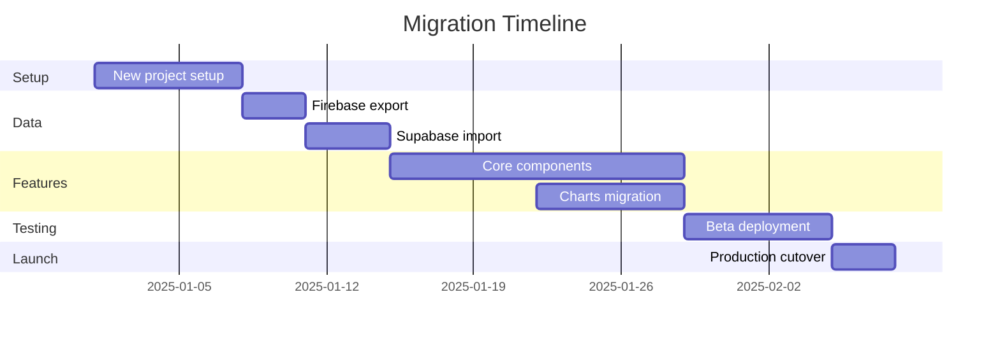

# Migration Strategy - Current Codebase to Modern Stack
## Quran Lights Web - Practical Transition Plan

---

## Current Codebase Analysis

### What You Have (Assets to Preserve)

#### ✅ **Core Business Logic** (24 JavaScript files)
```
dashboard/scripts/
├── suras_data.js          # 114 Surahs data (CRITICAL - reuse as-is)
├── cells.js               # Surah grid rendering logic
├── charts.js              # Chart initialization
├── time_series.js         # Daily/monthly/yearly charts
├── radar.js               # Radar chart for tracking
├── treemap.js             # Treemap visualization
├── memorization.js        # Memorization tracking
├── score.js               # Score calculation logic
├── sort.js                # Sorting algorithms
├── sync.js                # Firebase sync logic
├── state.js               # State management
└── ... (14 more files)
```

#### ✅ **Localization** (10 languages - KEEP)
```
locales/
├── ar.json    # Arabic (primary)
├── en.json    # English
├── es.json    # Spanish
├── fr.json    # French
├── de.json    # German
├── zh.json    # Chinese
├── hi.json    # Hindi
├── pt.json    # Portuguese
├── ur.json    # Urdu
└── ja.json    # Japanese
```

#### ✅ **Utilities & Constants** (REUSE)
- `constants.js` - Configuration values
- `utils.js` - Helper functions
- `i18n.js` - Localization logic

#### ✅ **UI Assets**
- CSS files (Bootstrap + custom)
- Images and icons
- Fonts

### What Needs Migration

| Component | Current | Target | Strategy |
|-----------|---------|--------|----------|
| **Frontend Framework** | Vanilla JS | Vite + React | Rewrite UI, port logic |
| **Backend** | Firebase | Supabase | Migrate data + auth |
| **State Management** | localStorage | React Context + Supabase | Hybrid approach |
| **Charts** | Highcharts | Recharts | Port configurations |
| **Styling** | Bootstrap | Tailwind CSS | Gradual replacement |
| **Build System** | None | Vite | New setup |

---

## Migration Strategy: Incremental Approach

### Strategy: **Parallel Development with Gradual Cutover**

**Why Not Big Bang Rewrite?**
- ❌ Too risky (months of work before users see value)
- ❌ Can't validate changes incrementally
- ❌ Hard to rollback if issues arise

**Why Incremental?**
- ✅ Keep current site running
- ✅ Migrate features one by one
- ✅ Test each migration step
- ✅ Easy rollback if needed
- ✅ Users can opt-in to beta

---

## Phase 1: Foundation Setup (Week 1)

### 1.1 Create New Project (Parallel to Current)

```bash
# Keep current project running at d:\quran_lights_web
# Create new project in parallel
cd d:\
mkdir quran_lights_v2
cd quran_lights_v2

# Initialize new stack
npm create vite@latest . -- --template react-ts
npm install

# Install dependencies
npm install @supabase/supabase-js
npm install -D tailwindcss postcss autoprefixer
npm install recharts lucide-react
npm install zustand # state management
npm install i18next react-i18next # localization
```

### 1.2 Copy Reusable Assets

```bash
# Copy localization files (no changes needed)
cp -r ../quran_lights_web/public/locales ./public/

# Copy Surah data (convert to TypeScript)
cp ../quran_lights_web/public/dashboard/scripts/suras_data.js ./src/data/

# Copy images and fonts
cp -r ../quran_lights_web/public/images ./public/
cp -r ../quran_lights_web/public/fonts ./public/
```

### 1.3 Set Up Supabase

```typescript
// src/lib/supabase.ts
import { createClient } from '@supabase/supabase-js'

const supabaseUrl = import.meta.env.VITE_SUPABASE_URL
const supabaseAnonKey = import.meta.env.VITE_SUPABASE_ANON_KEY

export const supabase = createClient(supabaseUrl, supabaseAnonKey)
```

---

## Phase 2: Data Migration (Week 2)

### 2.1 Export Firebase Data

```javascript
// scripts/export-firebase-data.js
// Run this in your CURRENT project

const admin = require('firebase-admin');
const fs = require('fs');

// Initialize Firebase Admin
const serviceAccount = require('./serviceAccountKey.json');
admin.initializeApp({
  credential: admin.credential.cert(serviceAccount),
  databaseURL: 'https://quran-lights.firebaseio.com'
});

const db = admin.database();

async function exportAllUsers() {
  const usersRef = db.ref('users');
  const snapshot = await usersRef.once('value');
  const users = snapshot.val();
  
  // Export to JSON
  fs.writeFileSync(
    'firebase-export-users.json',
    JSON.stringify(users, null, 2)
  );
  
  console.log('Exported users:', Object.keys(users).length);
}

async function exportUserData() {
  const dataRef = db.ref('user_data');
  const snapshot = await dataRef.once('value');
  const userData = snapshot.val();
  
  fs.writeFileSync(
    'firebase-export-data.json',
    JSON.stringify(userData, null, 2)
  );
  
  console.log('Exported user data');
}

// Run exports
exportAllUsers();
exportUserData();
```

### 2.2 Transform and Import to Supabase

```typescript
// scripts/import-to-supabase.ts
import { createClient } from '@supabase/supabase-js';
import * as fs from 'fs';

const supabase = createClient(
  process.env.SUPABASE_URL!,
  process.env.SUPABASE_SERVICE_KEY! // Use service role key
);

interface FirebaseUser {
  email: string;
  // ... other fields
}

interface FirebaseUserData {
  surahs: Record<string, {
    last_refresh: number;
    refresh_count: number;
    memorization_state: string;
  }>;
  settings: any;
}

async function importUsers() {
  const firebaseUsers = JSON.parse(
    fs.readFileSync('firebase-export-users.json', 'utf-8')
  );
  
  for (const [uid, user] of Object.entries(firebaseUsers as Record<string, FirebaseUser>)) {
    // Create user in Supabase Auth
    const { data: authUser, error: authError } = await supabase.auth.admin.createUser({
      email: user.email,
      email_confirm: true,
      user_metadata: {
        firebase_uid: uid,
        migrated_at: new Date().toISOString()
      }
    });
    
    if (authError) {
      console.error(`Failed to create user ${user.email}:`, authError);
      continue;
    }
    
    console.log(`Created user: ${user.email}`);
  }
}

async function importUserData() {
  const firebaseData = JSON.parse(
    fs.readFileSync('firebase-export-data.json', 'utf-8')
  );
  
  for (const [firebaseUid, userData] of Object.entries(firebaseData as Record<string, FirebaseUserData>)) {
    // Find Supabase user by firebase_uid
    const { data: users } = await supabase
      .from('profiles')
      .select('user_id')
      .eq('firebase_uid', firebaseUid)
      .single();
    
    if (!users) continue;
    
    // Import Surah progress
    for (const [surahId, surahData] of Object.entries(userData.surahs || {})) {
      await supabase.from('user_surah_progress').insert({
        user_id: users.user_id,
        surah_id: parseInt(surahId),
        last_recited_at: new Date(surahData.last_refresh * 1000).toISOString(),
        recitation_count: surahData.refresh_count,
        memorization_status: surahData.memorization_state
      });
    }
    
    console.log(`Imported data for user: ${firebaseUid}`);
  }
}

// Run imports
await importUsers();
await importUserData();
```

---

## Phase 3: Port Core Features (Weeks 3-5)

### 3.1 Feature Mapping

| Old Feature | Old File | New Component | Priority |
|-------------|----------|---------------|----------|
| Surah Grid | `cells.js` | `SurahGrid.tsx` | P0 (Critical) |
| Daily Chart | `time_series.js` | `DailyChart.tsx` | P0 |
| Monthly Chart | `time_series.js` | `MonthlyChart.tsx` | P0 |
| Yearly Chart | `time_series.js` | `YearlyChart.tsx` | P1 |
| Radar Chart | `radar.js` | `RadarChart.tsx` | P1 |
| Treemap | `treemap.js` | `TreemapChart.tsx` | P1 |
| Memorization | `memorization.js` | `MemorizationChart.tsx` | P2 |
| Score Display | `score.js` | `ScoreDisplay.tsx` | P0 |
| Settings | Various | `Settings.tsx` | P1 |

### 3.2 Convert Surah Data to TypeScript

```typescript
// src/data/surahs.ts
export interface Surah {
  id: number;
  name_arabic: string;
  name_english: string;
  revelation_order: number;
  verse_count: number;
  word_count: number;
  character_count: number;
}

export const SURAHS: Surah[] = [
  {
    id: 1,
    name_arabic: "الفاتحة",
    name_english: "Al-Fatiha",
    revelation_order: 5,
    verse_count: 7,
    word_count: 29,
    character_count: 139
  },
  // ... copy from suras_data.js and convert to TypeScript
];

export const FULL_QURAN_CHARACTERS = 322604;
```

### 3.3 Port Core Logic (Example: Score Calculation)

```typescript
// src/lib/scoring.ts
// Ported from score.js

import { FULL_QURAN_CHARACTERS } from '@/data/surahs';

export function calculateDailyScore(
  recitationsToday: Array<{ character_count: number }>
): number {
  return recitationsToday.reduce(
    (sum, r) => sum + r.character_count,
    0
  );
}

export function formatScore(score: number): string {
  if (score >= 1_000_000_000) {
    return `$${(score / 1_000_000_000).toFixed(1)}B`;
  } else if (score >= 1_000_000) {
    return `$${(score / 1_000_000).toFixed(1)}M`;
  } else if (score >= 1_000) {
    return `$${(score / 1_000).toFixed(1)}K`;
  }
  return `$${score.toFixed(0)}`;
}

export function calculateLightLevel(
  daysSinceLastRecitation: number,
  lightDays: number = 7
): number {
  if (daysSinceLastRecitation === 0) return 100;
  if (daysSinceLastRecitation >= lightDays) return 0;
  
  return Math.max(0, 100 - (daysSinceLastRecitation / lightDays) * 100);
}
```

### 3.4 Create React Components (Example: Surah Grid)

```typescript
// src/components/SurahGrid.tsx
import { useState, useEffect } from 'react';
import { supabase } from '@/lib/supabase';
import { SURAHS } from '@/data/surahs';
import { calculateLightLevel } from '@/lib/scoring';

interface SurahProgress {
  surah_id: number;
  last_recited_at: string | null;
  recitation_count: number;
  memorization_status: string;
}

export function SurahGrid() {
  const [progress, setProgress] = useState<Record<number, SurahProgress>>({});
  const [loading, setLoading] = useState(true);

  useEffect(() => {
    loadProgress();
  }, []);

  async function loadProgress() {
    const { data: { user } } = await supabase.auth.getUser();
    if (!user) return;

    const { data } = await supabase
      .from('user_surah_progress')
      .select('*')
      .eq('user_id', user.id);

    const progressMap = (data || []).reduce((acc, item) => {
      acc[item.surah_id] = item;
      return acc;
    }, {} as Record<number, SurahProgress>);

    setProgress(progressMap);
    setLoading(false);
  }

  async function handleSurahClick(surahId: number) {
    const { data: { user } } = await supabase.auth.getUser();
    if (!user) return;

    // Update recitation
    await supabase.from('user_surah_progress').upsert({
      user_id: user.id,
      surah_id: surahId,
      last_recited_at: new Date().toISOString(),
      recitation_count: (progress[surahId]?.recitation_count || 0) + 1
    });

    // Reload progress
    loadProgress();
  }

  if (loading) return <div>Loading...</div>;

  return (
    <div className="grid grid-cols-6 md:grid-cols-12 gap-2 p-4">
      {SURAHS.map((surah) => {
        const surahProgress = progress[surah.id];
        const daysSince = surahProgress?.last_recited_at
          ? Math.floor(
              (Date.now() - new Date(surahProgress.last_recited_at).getTime()) /
              (1000 * 60 * 60 * 24)
            )
          : 999;
        
        const lightLevel = calculateLightLevel(daysSince);
        
        return (
          <div
            key={surah.id}
            onClick={() => handleSurahClick(surah.id)}
            className="relative aspect-square rounded-lg cursor-pointer transition-all hover:scale-105"
            style={{
              backgroundColor: `rgba(76, 175, 80, ${lightLevel / 100})`,
              border: '2px solid rgba(76, 175, 80, 0.3)'
            }}
          >
            <div className="absolute inset-0 flex flex-col items-center justify-center text-white text-xs">
              <div className="font-bold">{surah.id}</div>
              <div className="text-[10px] mt-1">{daysSince < 999 ? `${daysSince}d` : '-'}</div>
            </div>
          </div>
        );
      })}
    </div>
  );
}
```

---

## Phase 4: Dual-Run Strategy (Week 6)

### 4.1 Deploy New Version to Subdomain

```bash
# Deploy new version to beta.quranlights.net
# Keep old version at quranlights.net

# Vercel deployment
vercel --prod --alias beta.quranlights.net
```

### 4.2 Add Migration Banner to Old Site

```html
<!-- Add to old index.html -->
<div style="background: #4CAF50; color: white; padding: 10px; text-align: center;">
  🎉 Try our new and improved version! 
  <a href="https://beta.quranlights.net" style="color: white; text-decoration: underline;">
    Click here to preview
  </a>
</div>
```

### 4.3 User Testing & Feedback

**Week 6 Goals:**
- Get 50 beta testers
- Collect feedback
- Fix critical bugs
- Validate data migration

---

## Phase 5: Cutover (Week 7)

### 5.1 Final Data Sync

```typescript
// Run one final sync before cutover
// This catches any new data created during beta period
await importUserData(); // Re-run migration script
```

### 5.2 DNS Cutover

```bash
# Update DNS to point quranlights.net to new version
# Keep old version at legacy.quranlights.net for 30 days
```

### 5.3 Monitoring

```typescript
// Add error tracking
import * as Sentry from "@sentry/react";

Sentry.init({
  dsn: "your-sentry-dsn",
  environment: "production",
  tracesSampleRate: 1.0,
});
```

---

## Asset Reuse Strategy

### ✅ **100% Reusable (Copy As-Is)**

1. **Localization Files** (`locales/*.json`)
   - No changes needed
   - Use with react-i18next

2. **Surah Data** (`suras_data.js`)
   - Convert to TypeScript
   - Export as constant

3. **Images & Fonts**
   - Copy to `public/` folder
   - Reference directly

4. **Constants** (`constants.js`)
   - Convert to TypeScript
   - Export as config

### 🔄 **Needs Adaptation (Port Logic)**

1. **Business Logic**
   - Score calculation → TypeScript functions
   - Sorting algorithms → TypeScript utilities
   - Date formatting → TypeScript helpers

2. **Chart Configurations**
   - Highcharts → Recharts
   - Port data structures
   - Keep visual design

### ❌ **Replace Completely**

1. **UI Components**
   - Vanilla JS → React components
   - Bootstrap → Tailwind CSS
   - jQuery → React hooks

2. **State Management**
   - localStorage → Supabase + React Context
   - Firebase sync → Supabase realtime

---

## Migration Checklist

### Pre-Migration
- [ ] Export all Firebase data
- [ ] Set up Supabase project
- [ ] Create database schema
- [ ] Test data import script

### Week 1: Setup
- [ ] Create new Vite project
- [ ] Copy reusable assets
- [ ] Set up Tailwind CSS
- [ ] Configure i18next

### Week 2: Data
- [ ] Run Firebase export
- [ ] Import users to Supabase
- [ ] Import user data
- [ ] Verify data integrity

### Week 3-5: Features
- [ ] Port Surah grid component
- [ ] Port daily chart
- [ ] Port monthly chart
- [ ] Port score display
- [ ] Port settings
- [ ] Port remaining charts

### Week 6: Testing
- [ ] Deploy to beta subdomain
- [ ] Invite beta testers
- [ ] Fix critical bugs
- [ ] Collect feedback

### Week 7: Launch
- [ ] Final data sync
- [ ] Update DNS
- [ ] Monitor errors
- [ ] Support users

---

## Rollback Plan

**If Issues Arise:**

1. **Immediate Rollback** (< 1 hour)
   ```bash
   # Revert DNS to old site
   # Old site still running at legacy.quranlights.net
   ```

2. **Keep Old Site Running**
   - Maintain for 30 days
   - Allow users to access old data
   - Gradual migration

3. **Data Sync Both Ways**
   - Keep Firebase active during transition
   - Sync changes back if needed

---

## Cost During Migration

| Service | Cost | Duration |
|---------|------|----------|
| Vercel (2 deployments) | $0 | 7 weeks |
| Supabase Free | $0 | 7 weeks |
| Firebase (keep running) | ~$0 | 7 weeks |
| Domain (beta subdomain) | $0 | 7 weeks |
| **Total** | **$0** | **7 weeks** |

---

## Timeline Summary



---

## Next Steps

### Option 1: Start Fresh (Recommended for Solo Founder)
- Follow the bootstrapped plan
- Build new version from scratch
- Migrate data when ready
- **Timeline:** 6 weeks to launch

### Option 2: Gradual Migration
- Follow this migration plan
- Port features incrementally
- Keep old site running
- **Timeline:** 7 weeks to cutover

### Option 3: Hybrid Approach
- Start with new features in new stack
- Keep old features in old site
- Gradually replace old features
- **Timeline:** 12 weeks to complete

---

## Recommendation

**For a solo founder with $0 budget, I recommend Option 1 (Start Fresh):**

**Why?**
1. ✅ Faster to market (6 weeks vs 7-12 weeks)
2. ✅ Cleaner codebase (no technical debt)
3. ✅ Better learning experience
4. ✅ Can reuse data and assets
5. ✅ Old site stays live during development

**How to Handle Current Users:**
1. Keep old site at `legacy.quranlights.net`
2. Build new site at `quranlights.net`
3. Provide data export/import
4. Gradual user migration over 3 months

**What to Reuse:**
- ✅ All localization files (10 languages)
- ✅ Surah data (convert to TypeScript)
- ✅ Images and fonts
- ✅ Core business logic (port to TypeScript)
- ✅ User data (migration script)

**What to Rebuild:**
- UI components (React + Tailwind)
- Charts (Recharts)
- State management (React + Supabase)
- Authentication (Supabase Auth)

---

**Ready to start? I can help you with:**
1. Setting up the new project structure
2. Converting Surah data to TypeScript
3. Creating the data migration script
4. Building the first React components
5. Setting up Supabase schema

Which would you like to tackle first?
